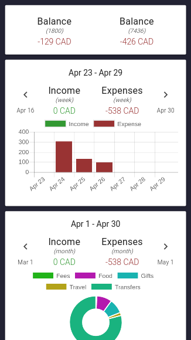
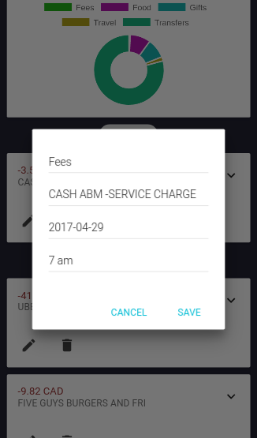
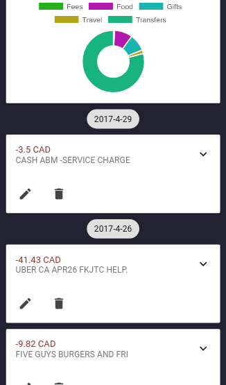

# ![eun][logo]

[![npm][npm-badge]][npm][![Build Status][build-badge]][build-status] [![Standard code style][standard-badge]][standard] [![License][license-badge]][license]

* **automatically** logs **expenses** by **monitoring** mail
* provides weekly and monthly **cash flow** of expenses and income
* **authentication** using a secret key (uses Storage API to store token locally)

  

## Installation

Available on [npm][]

### Node

```bash
git clone https://github.com/omarchehab98/eun
cd eun
npm install

# development
# run both in seperate terminals
npm run dev-client
npm run dev-server

# production
npm run build
npm start
```

### Docker

```bash
git clone https://github.com/omarchehab98/eun
cd eun
docker-compose up
```

## Development

### Prerequisites

If you are planning to develop a feature or fix a bug, you should be familiar with the stack.

* Client
  * web browser
  * [react](https://github.com/facebook/react)
  * [material-ui](https://github.com/callemall/material-ui)
* Server
  * node
  * [express](https://github.com/expressjs/express)
  * [mongoose](https://github.com/Automattic/mongoose)
  * [imap](https://github.com/mscdex/node-imap)

### Hot Reloading

* `npm run dev-client`
Watches the client directory, keeps browser in sync with new changes.

* `npm run dev-server`
Watches the server directory, restarts server when changes are made.

When submitting a merge request, it must pass all three commands below.
```
npm run build
npm run lint
npm test
```

## License

[MIT][license] © [Omar Chehab][author]

<!-- Definitions -->

[logo]: https://cdn.rawgit.com/omarchehab98/eun/312f622f/logo.svg

[build-badge]: https://travis-ci.org/omarchehab98/eun.svg?branch=master

[build-status]: https://travis-ci.org/omarchehab98/eun

[standard]: http://standardjs.com

[standard-badge]: https://img.shields.io/badge/code_style-standard-brightgreen.svg

[license-badge]: https://img.shields.io/github/license/omarchehab98/eun.svg

[license]: https://github.com/omarchehab98/eun/blob/master/LICENSE

[author]: https://omarchehab.com

[npm]: https://www.npmjs.com/package/eun

[npm-badge]: https://img.shields.io/npm/v/eun.svg
